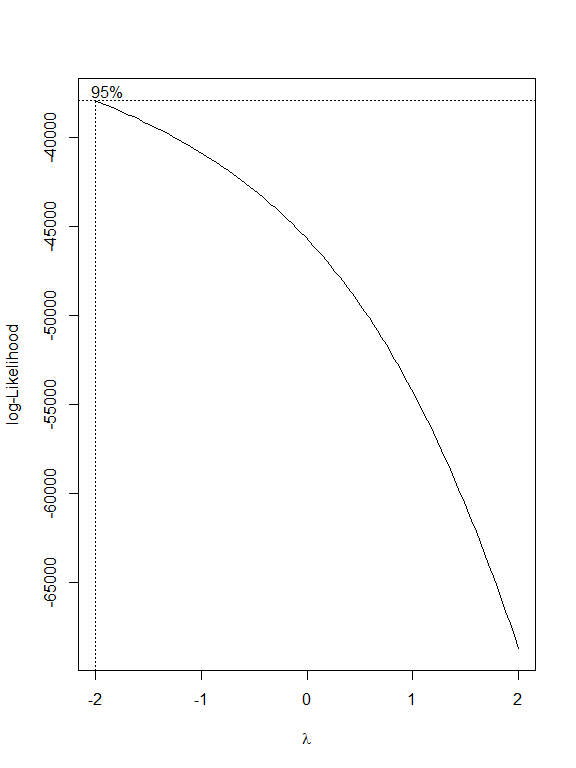
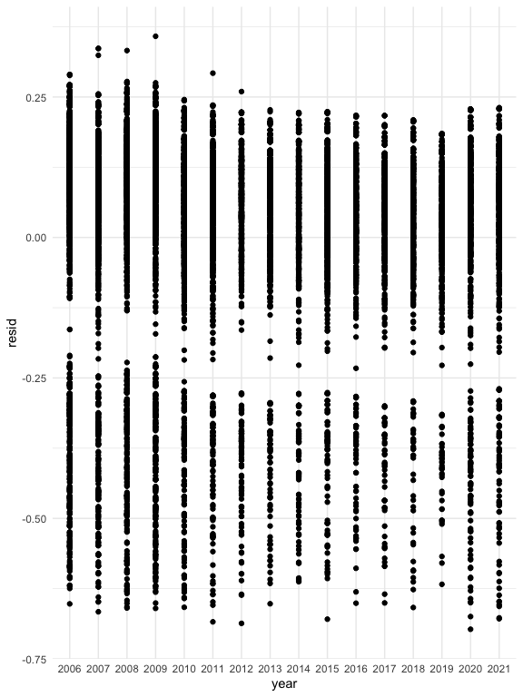
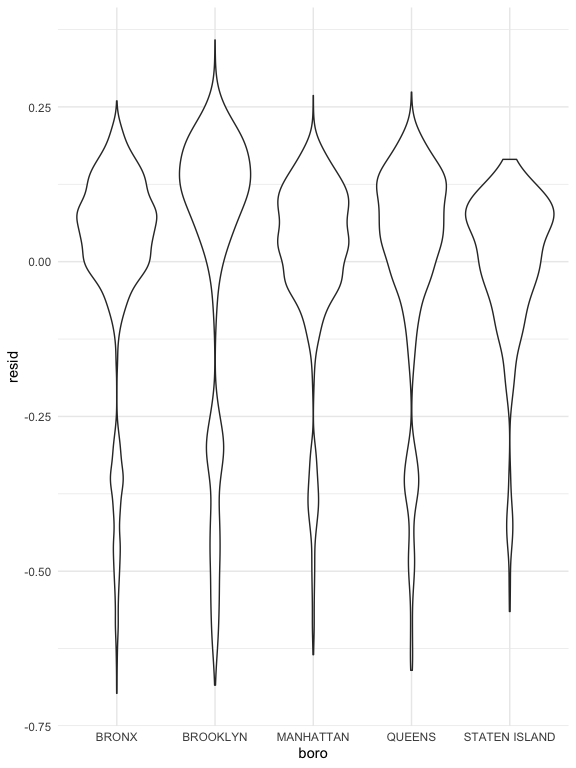
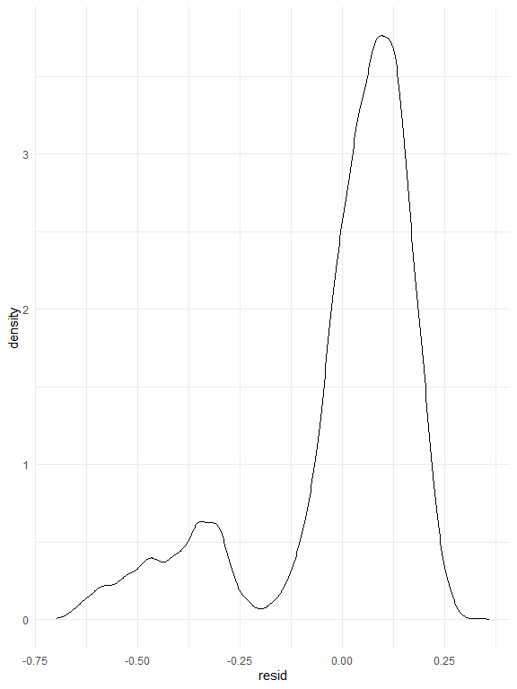
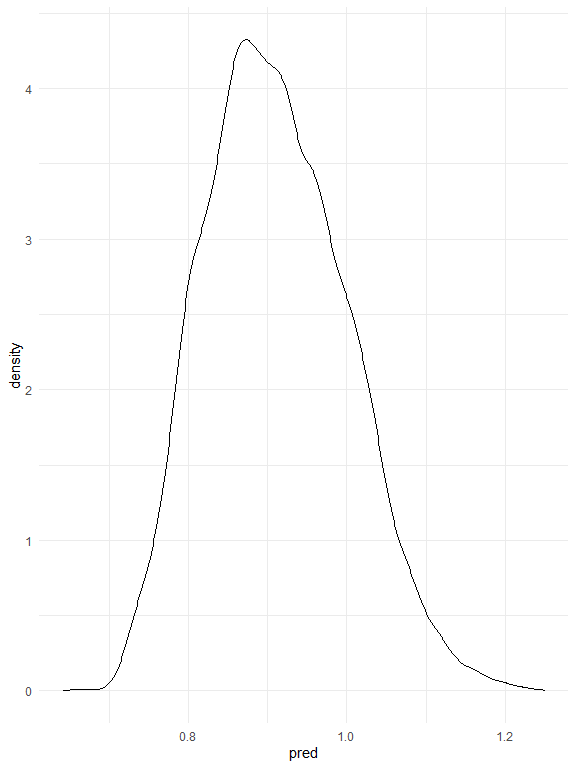
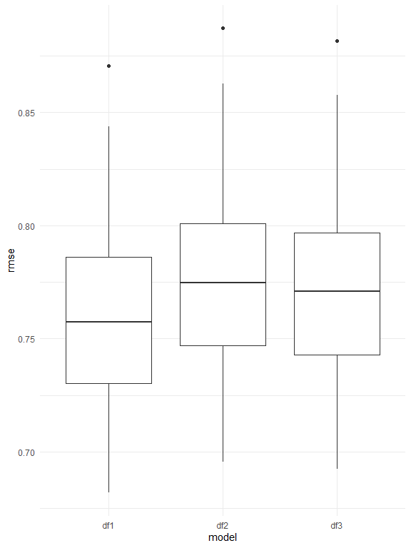

Regression Analysis
================

### Dataset Demonsatration

The NYPD Shooting Data was collected from the [NYC Open
Data](https://data.cityofnewyork.us/Public-Safety/NYPD-Shooting-Incident-Data-Year-To-Date-/5ucz-vwe8).
The dataset includes 1,531 rows and 19 columns. The variables included
in the dataset were listed below:

-   ‘year’. year of shooting incident
-   ‘month’. month of the shooting incident
-   ‘day’. day of the shooting incident
-   ‘boro’. borough where the shooting incident occurred
-   ‘location\_desc’. location of the shooting incident
-   ‘statistical\_murder\_flag’. Shooting resulted in the victim’s death
    which would be counted as a murder
-   ‘perp\_age\_group’. perpetrator’s age within a category
-   ‘perp\_sex’. perpetrator’s sex description
-   ‘perp\_race’. perpetrator’s race description
-   ‘vic\_age\_group’. victim’s age within a category
-   ‘vic\_sex’. victim’s sex description
-   ‘vic\_race’. victim’s race description
-   ‘zipcode’. zipcode of the shooting incident

## Multiple linear regression model

### Box-Cox transformation

The box-cox method is applied in the model to determine the
transformation of outcome variable. The variable ‘location\_desc’
includes too many missing value. It was not included in the multiple
linear regression analysis. All the missing values from our dataset was
omitted. The λ is close to - 2, 1 / Y transformation is applied.

<!-- -->

### Regression analysis results

| term                                      | estimate | std.error | statistic | p.value |
|:------------------------------------------|---------:|----------:|----------:|--------:|
| (Intercept)                               |    1.226 |     0.158 |     7.767 |   0.000 |
| Year:2007                                 |    0.035 |     0.008 |     4.486 |   0.000 |
| Year:2008                                 |    0.013 |     0.008 |     1.616 |   0.106 |
| Year:2009                                 |    0.001 |     0.008 |     0.122 |   0.903 |
| Year:2010                                 |    0.045 |     0.008 |     5.386 |   0.000 |
| Year:2011                                 |    0.053 |     0.009 |     6.015 |   0.000 |
| Year:2012                                 |    0.049 |     0.009 |     5.254 |   0.000 |
| Year:2013                                 |    0.066 |     0.010 |     6.809 |   0.000 |
| Year:2014                                 |    0.049 |     0.010 |     5.108 |   0.000 |
| Year:2015                                 |    0.048 |     0.009 |     5.070 |   0.000 |
| Year:2016                                 |    0.055 |     0.010 |     5.504 |   0.000 |
| Year:2017                                 |    0.072 |     0.010 |     6.919 |   0.000 |
| Year:2018                                 |    0.063 |     0.011 |     6.006 |   0.000 |
| Year:2019                                 |    0.087 |     0.010 |     8.375 |   0.000 |
| Year:2020                                 |    0.043 |     0.009 |     4.736 |   0.000 |
| Year:2021                                 |    0.041 |     0.010 |     4.216 |   0.000 |
| Month:February                            |    0.021 |     0.010 |     2.198 |   0.028 |
| Month:March                               |    0.005 |     0.009 |     0.508 |   0.611 |
| Month:April                               |   -0.003 |     0.009 |    -0.287 |   0.774 |
| Month:May                                 |   -0.009 |     0.009 |    -1.079 |   0.281 |
| Month:June                                |   -0.029 |     0.009 |    -3.399 |   0.001 |
| Month:July                                |   -0.029 |     0.008 |    -3.404 |   0.001 |
| Month:August                              |   -0.031 |     0.008 |    -3.653 |   0.000 |
| Month:September                           |   -0.016 |     0.009 |    -1.888 |   0.059 |
| Month:October                             |   -0.009 |     0.009 |    -1.063 |   0.288 |
| Month:November                            |    0.004 |     0.009 |     0.466 |   0.641 |
| Month:December                            |   -0.008 |     0.009 |    -0.832 |   0.405 |
| Borough:BROOKLYN                          |   -0.050 |     0.005 |   -11.161 |   0.000 |
| Borough:MANHATTAN                         |    0.033 |     0.005 |     6.104 |   0.000 |
| Borough:QUEENS                            |    0.015 |     0.005 |     2.815 |   0.005 |
| Borough:STATEN ISLAND                     |    0.074 |     0.009 |     8.270 |   0.000 |
| Muder Flag:TRUE                           |    0.056 |     0.004 |    13.126 |   0.000 |
| Perpetrator sex:M                         |   -0.077 |     0.011 |    -7.234 |   0.000 |
| Perpetrator sex:U                         |   -0.178 |     0.016 |   -11.104 |   0.000 |
| Perpetrator race:ASIAN / PACIFIC ISLANDER |   -0.055 |     0.140 |    -0.394 |   0.694 |
| Perpetrator race:BLACK                    |   -0.117 |     0.139 |    -0.842 |   0.400 |
| Perpetrator race:BLACK HISPANIC           |   -0.043 |     0.139 |    -0.310 |   0.756 |
| Perpetrator race:UNKNOWN                  |   -0.034 |     0.139 |    -0.242 |   0.809 |
| Perpetrator race:WHITE                    |   -0.087 |     0.140 |    -0.624 |   0.533 |
| Perpetrator race:WHITE HISPANIC           |   -0.058 |     0.139 |    -0.421 |   0.674 |
| Victim sex:M                              |   -0.095 |     0.005 |   -18.192 |   0.000 |
| Victim sex:U                              |   -0.030 |     0.070 |    -0.425 |   0.671 |
| Victim race:ASIAN / PACIFIC ISLANDER      |   -0.020 |     0.075 |    -0.265 |   0.791 |
| Victim race:BLACK                         |   -0.128 |     0.074 |    -1.727 |   0.084 |
| Victim race:BLACK HISPANIC                |   -0.030 |     0.074 |    -0.401 |   0.689 |
| Victim race:UNKNOWN                       |   -0.003 |     0.080 |    -0.033 |   0.974 |
| Victim race:WHITE                         |   -0.031 |     0.075 |    -0.407 |   0.684 |
| Victim race:WHITE HISPANIC                |   -0.048 |     0.074 |    -0.645 |   0.519 |

Our regression model included year, month, borough, perpetrator’s sex
and race, and victim’s sex and race as the predictors. The regression
results year, month, borough, perpetrator’s sex, and victim’s sex are
significant predictor variable for the number of shooting in NYC. Among
the month variable, May, June, July, August, September, October, and
December have lower number of shooting than January.And among the
borough, compared with Bronx, Brooklyn have less number of shooting, and
Manhattan, Queens, and Staten Island have more number of shooting.The
next step is to use stepwise regression in backward direction to build
our regression model.

### backward stepwise regression

    ## Start:  AIC=-41162.41
    ## number_shoot ~ year + month + boro + statistical_murder_flag + 
    ##     perp_sex + perp_race + vic_sex + vic_race
    ## 
    ##                           Df Sum of Sq    RSS    AIC
    ## <none>                                 484.22 -41162
    ## - month                   11    2.7532 486.97 -41113
    ## - perp_sex                 2    4.7390 488.95 -41043
    ## - year                    15    6.9645 491.18 -41012
    ## - statistical_murder_flag  1    6.6222 490.84 -40993
    ## - perp_race                6    9.7584 493.97 -40922
    ## - vic_sex                  2   12.7473 496.96 -40838
    ## - boro                     4   15.2279 499.44 -40779
    ## - vic_race                 6   20.9959 505.21 -40638

| term                                      | estimate | std.error | statistic | p.value |
|:------------------------------------------|---------:|----------:|----------:|--------:|
| (Intercept)                               |    1.226 |     0.158 |     7.767 |   0.000 |
| Year:2007                                 |    0.035 |     0.008 |     4.486 |   0.000 |
| Year:2008                                 |    0.013 |     0.008 |     1.616 |   0.106 |
| Year:2009                                 |    0.001 |     0.008 |     0.122 |   0.903 |
| Year:2010                                 |    0.045 |     0.008 |     5.386 |   0.000 |
| Year:2011                                 |    0.053 |     0.009 |     6.015 |   0.000 |
| Year:2012                                 |    0.049 |     0.009 |     5.254 |   0.000 |
| Year:2013                                 |    0.066 |     0.010 |     6.809 |   0.000 |
| Year:2014                                 |    0.049 |     0.010 |     5.108 |   0.000 |
| Year:2015                                 |    0.048 |     0.009 |     5.070 |   0.000 |
| Year:2016                                 |    0.055 |     0.010 |     5.504 |   0.000 |
| Year:2017                                 |    0.072 |     0.010 |     6.919 |   0.000 |
| Year:2018                                 |    0.063 |     0.011 |     6.006 |   0.000 |
| Year:2019                                 |    0.087 |     0.010 |     8.375 |   0.000 |
| Year:2020                                 |    0.043 |     0.009 |     4.736 |   0.000 |
| Year:2021                                 |    0.041 |     0.010 |     4.216 |   0.000 |
| Month:February                            |    0.021 |     0.010 |     2.198 |   0.028 |
| Month:March                               |    0.005 |     0.009 |     0.508 |   0.611 |
| Month:April                               |   -0.003 |     0.009 |    -0.287 |   0.774 |
| Month:May                                 |   -0.009 |     0.009 |    -1.079 |   0.281 |
| Month:June                                |   -0.029 |     0.009 |    -3.399 |   0.001 |
| Month:July                                |   -0.029 |     0.008 |    -3.404 |   0.001 |
| Month:August                              |   -0.031 |     0.008 |    -3.653 |   0.000 |
| Month:September                           |   -0.016 |     0.009 |    -1.888 |   0.059 |
| Month:October                             |   -0.009 |     0.009 |    -1.063 |   0.288 |
| Month:November                            |    0.004 |     0.009 |     0.466 |   0.641 |
| Month:December                            |   -0.008 |     0.009 |    -0.832 |   0.405 |
| Borough:BROOKLYN                          |   -0.050 |     0.005 |   -11.161 |   0.000 |
| Borough:MANHATTAN                         |    0.033 |     0.005 |     6.104 |   0.000 |
| Borough:QUEENS                            |    0.015 |     0.005 |     2.815 |   0.005 |
| Borough:STATEN ISLAND                     |    0.074 |     0.009 |     8.270 |   0.000 |
| Muder Flag:TRUE                           |    0.056 |     0.004 |    13.126 |   0.000 |
| Perpetrator sex:M                         |   -0.077 |     0.011 |    -7.234 |   0.000 |
| Perpetrator sex:U                         |   -0.178 |     0.016 |   -11.104 |   0.000 |
| Perpetrator race:ASIAN / PACIFIC ISLANDER |   -0.055 |     0.140 |    -0.394 |   0.694 |
| Perpetrator race:BLACK                    |   -0.117 |     0.139 |    -0.842 |   0.400 |
| Perpetrator race:BLACK HISPANIC           |   -0.043 |     0.139 |    -0.310 |   0.756 |
| Perpetrator race:UNKNOWN                  |   -0.034 |     0.139 |    -0.242 |   0.809 |
| Perpetrator race:WHITE                    |   -0.087 |     0.140 |    -0.624 |   0.533 |
| Perpetrator race:WHITE HISPANIC           |   -0.058 |     0.139 |    -0.421 |   0.674 |
| Victim sex:M                              |   -0.095 |     0.005 |   -18.192 |   0.000 |
| Victim sex:U                              |   -0.030 |     0.070 |    -0.425 |   0.671 |
| Victim race:ASIAN / PACIFIC ISLANDER      |   -0.020 |     0.075 |    -0.265 |   0.791 |
| Victim race:BLACK                         |   -0.128 |     0.074 |    -1.727 |   0.084 |
| Victim race:BLACK HISPANIC                |   -0.030 |     0.074 |    -0.401 |   0.689 |
| Victim race:UNKNOWN                       |   -0.003 |     0.080 |    -0.033 |   0.974 |
| Victim race:WHITE                         |   -0.031 |     0.075 |    -0.407 |   0.684 |
| Victim race:WHITE HISPANIC                |   -0.048 |     0.074 |    -0.645 |   0.519 |

The backward stepwise regression chose the regression model with minimum
AIC value. However, the stepwise regression did not omit any predictor,
which indicates that the current regression model is sufficient to
explain the outcome - number of shooing in NYC.

### Multiple Linear Regression diagnose

    ## 
    ## Call:
    ## lm(formula = number_shoot ~ year + month + boro + statistical_murder_flag + 
    ##     perp_sex + perp_race + vic_sex + vic_race, data = mlr_lm)
    ## 
    ## Residuals:
    ##      Min       1Q   Median       3Q      Max 
    ## -0.69726 -0.03078  0.05856  0.12567  0.35808 
    ## 
    ## Coefficients:
    ##                                     Estimate Std. Error t value Pr(>|t|)    
    ## (Intercept)                        1.2262078  0.1578656   7.767 8.63e-15 ***
    ## year2007                           0.0348428  0.0077674   4.486 7.33e-06 ***
    ## year2008                           0.0125014  0.0077366   1.616 0.106146    
    ## year2009                           0.0009724  0.0079689   0.122 0.902885    
    ## year2010                           0.0446740  0.0082950   5.386 7.35e-08 ***
    ## year2011                           0.0527293  0.0087660   6.015 1.85e-09 ***
    ## year2012                           0.0490162  0.0093294   5.254 1.51e-07 ***
    ## year2013                           0.0662468  0.0097290   6.809 1.03e-11 ***
    ## year2014                           0.0494474  0.0096808   5.108 3.31e-07 ***
    ## year2015                           0.0479661  0.0094613   5.070 4.04e-07 ***
    ## year2016                           0.0549412  0.0099820   5.504 3.78e-08 ***
    ## year2017                           0.0715502  0.0103411   6.919 4.77e-12 ***
    ## year2018                           0.0630729  0.0105022   6.006 1.96e-09 ***
    ## year2019                           0.0870240  0.0103911   8.375  < 2e-16 ***
    ## year2020                           0.0433503  0.0091543   4.736 2.21e-06 ***
    ## year2021                           0.0411906  0.0097702   4.216 2.50e-05 ***
    ## monthFebruary                      0.0213689  0.0097223   2.198 0.027973 *  
    ## monthMarch                         0.0047129  0.0092724   0.508 0.611274    
    ## monthApril                        -0.0025799  0.0089907  -0.287 0.774157    
    ## monthMay                          -0.0092405  0.0085635  -1.079 0.280580    
    ## monthJune                         -0.0290994  0.0085608  -3.399 0.000678 ***
    ## monthJuly                         -0.0286696  0.0084229  -3.404 0.000667 ***
    ## monthAugust                       -0.0307366  0.0084143  -3.653 0.000260 ***
    ## monthSeptember                    -0.0164833  0.0087297  -1.888 0.059025 .  
    ## monthOctober                      -0.0094738  0.0089116  -1.063 0.287762    
    ## monthNovember                      0.0042710  0.0091630   0.466 0.641141    
    ## monthDecember                     -0.0076875  0.0092362  -0.832 0.405243    
    ## boroBROOKLYN                      -0.0503850  0.0045144 -11.161  < 2e-16 ***
    ## boroMANHATTAN                      0.0330639  0.0054168   6.104 1.07e-09 ***
    ## boroQUEENS                         0.0152834  0.0054286   2.815 0.004880 ** 
    ## boroSTATEN ISLAND                  0.0744201  0.0089991   8.270  < 2e-16 ***
    ## statistical_murder_flagTRUE        0.0556428  0.0042391  13.126  < 2e-16 ***
    ## perp_sexM                         -0.0766452  0.0105947  -7.234 4.95e-13 ***
    ## perp_sexU                         -0.1781447  0.0160435 -11.104  < 2e-16 ***
    ## perp_raceASIAN / PACIFIC ISLANDER -0.0551459  0.1399945  -0.394 0.693651    
    ## perp_raceBLACK                    -0.1169194  0.1389091  -0.842 0.399973    
    ## perp_raceBLACK HISPANIC           -0.0431230  0.1390342  -0.310 0.756444    
    ## perp_raceUNKNOWN                  -0.0336672  0.1392922  -0.242 0.809015    
    ## perp_raceWHITE                    -0.0870149  0.1395317  -0.624 0.532888    
    ## perp_raceWHITE HISPANIC           -0.0584750  0.1389725  -0.421 0.673932    
    ## vic_sexM                          -0.0950415  0.0052244 -18.192  < 2e-16 ***
    ## vic_sexU                          -0.0296688  0.0697315  -0.425 0.670500    
    ## vic_raceASIAN / PACIFIC ISLANDER  -0.0199821  0.0753583  -0.265 0.790889    
    ## vic_raceBLACK                     -0.1282827  0.0742964  -1.727 0.084258 .  
    ## vic_raceBLACK HISPANIC            -0.0298119  0.0744343  -0.401 0.688786    
    ## vic_raceUNKNOWN                   -0.0026588  0.0801353  -0.033 0.973533    
    ## vic_raceWHITE                     -0.0305139  0.0748959  -0.407 0.683708    
    ## vic_raceWHITE HISPANIC            -0.0479599  0.0743821  -0.645 0.519083    
    ## ---
    ## Signif. codes:  0 '***' 0.001 '**' 0.01 '*' 0.05 '.' 0.1 ' ' 1
    ## 
    ## Residual standard error: 0.1961 on 12598 degrees of freedom
    ## Multiple R-squared:  0.1703, Adjusted R-squared:  0.1672 
    ## F-statistic:    55 on 47 and 12598 DF,  p-value: < 2.2e-16

<!-- --><!-- --><!-- --><!-- -->

The residuals plot of year and borough did not show any distribution
pattern which indicated the good fit of model. However, the residual
density plot indicated some outliers.

## Cross Validation between different regression models

<!-- -->

Our cross validation include three different models. The first model
includes all the predictors. The second model includes only the
significant predictors. the third model includes interaction of borough
and sex.

The cross validation section, the root mean square deviations were
calculated for all the three models. the RMSE plot shows that RMSE of
all model are similar. And the first model have the lowest RMSE, which
indicates the first model may be the best model to explain the outcome -
number of shooting in NYC.

Here’s the link back to [Homepage](index.html) page.
