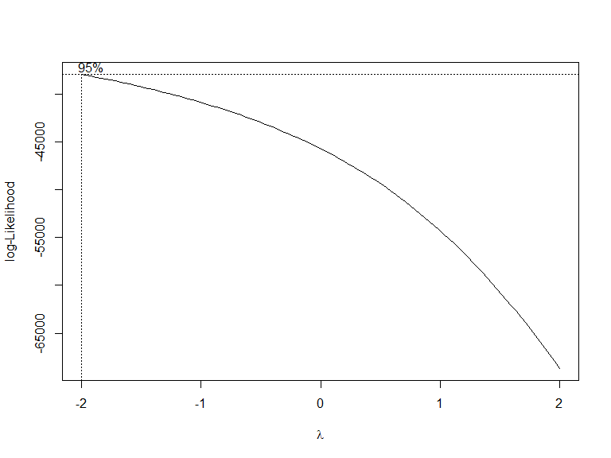
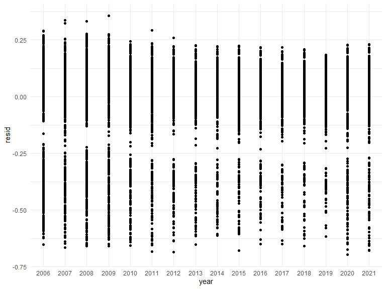
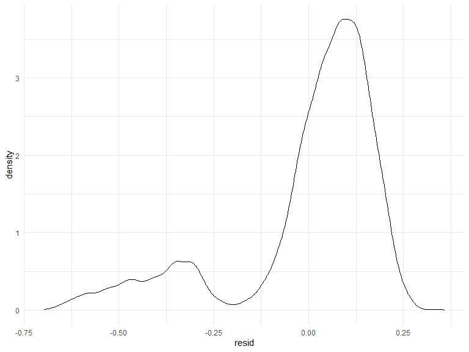
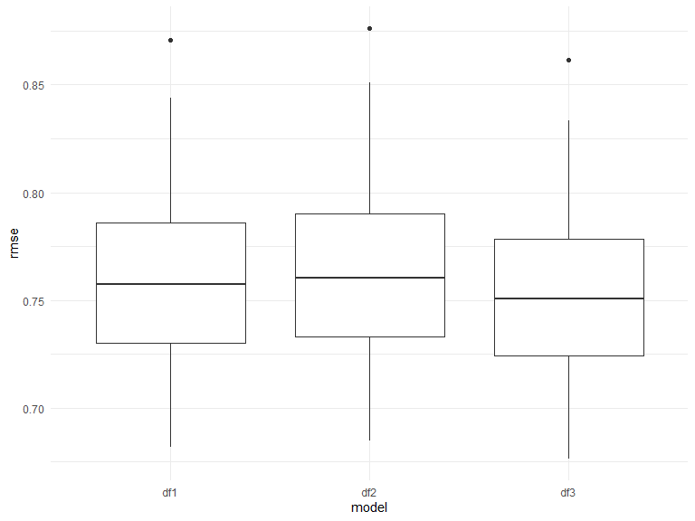

risk_factors
================
Yu He
12/5/2021

## Regression Analysis

The NYPD Shooting Data was collected from the ‘NYC Open Data’. The
dataset includes 1,531 rows and 19 columns. The variables included in
the dataset were listed below:

-   ‘year’. year of shooting incident
-   ‘month’. month of the shooting incident
-   ‘day’. day of the shooting incident
-   ‘boro’. borough where the shooting incident occurred
-   ‘location_desc’. location of the shooting incident
-   ‘statistical_murder_flag’. Shooting resulted in the victim’s death
    which would be counted as a murder
-   ‘perp_age_group’. perpetrator’s age within a category
-   ‘perp_sex’. perpetrator’s sex description
-   ‘perp_race’. perpetrator’s race description
-   ‘vic_age_group’. victim’s age within a category
-   ‘vic_sex’. victim’s sex description
-   ‘vic_race’. victim’s race description
-   ‘zipcode’. zipcode of the shooting incident

## Multiple linear regression model

### Box-Cox transformation

The box-cox method is applied in the model to determine the
transformation of outcome variable. The variable ‘location_desc’
includes too many missing value. It was not included in the multiple
linear regression analysis. All the missing values from our dataset was
omitted. The λ is close to - 2, 1 / Y transformation is applied.



### Regression analysis results

| term                                      | estimate | std.error | statistic | p.value |
|:------------------------------------------|---------:|----------:|----------:|--------:|
| (Intercept)                               |    1.226 |     0.158 |     7.767 |   0.000 |
| Year:2007                                 |    0.035 |     0.008 |     4.486 |   0.000 |
| Year:2008                                 |    0.013 |     0.008 |     1.616 |   0.106 |
| Year:2009                                 |    0.001 |     0.008 |     0.122 |   0.903 |
| Year:2010                                 |    0.045 |     0.008 |     5.386 |   0.000 |
| Year:2011                                 |    0.053 |     0.009 |     6.015 |   0.000 |
| Year:2012                                 |    0.049 |     0.009 |     5.254 |   0.000 |
| Year:2013                                 |    0.066 |     0.010 |     6.809 |   0.000 |
| Year:2014                                 |    0.049 |     0.010 |     5.108 |   0.000 |
| Year:2015                                 |    0.048 |     0.009 |     5.070 |   0.000 |
| Year:2016                                 |    0.055 |     0.010 |     5.504 |   0.000 |
| Year:2017                                 |    0.072 |     0.010 |     6.919 |   0.000 |
| Year:2018                                 |    0.063 |     0.011 |     6.006 |   0.000 |
| Year:2019                                 |    0.087 |     0.010 |     8.375 |   0.000 |
| Year:2020                                 |    0.043 |     0.009 |     4.736 |   0.000 |
| Year:2021                                 |    0.041 |     0.010 |     4.216 |   0.000 |
| Month:February                            |    0.021 |     0.010 |     2.198 |   0.028 |
| Month:March                               |    0.005 |     0.009 |     0.508 |   0.611 |
| Month:April                               |   -0.003 |     0.009 |    -0.287 |   0.774 |
| Month:May                                 |   -0.009 |     0.009 |    -1.079 |   0.281 |
| Month:June                                |   -0.029 |     0.009 |    -3.399 |   0.001 |
| Month:July                                |   -0.029 |     0.008 |    -3.404 |   0.001 |
| Month:August                              |   -0.031 |     0.008 |    -3.653 |   0.000 |
| Month:September                           |   -0.016 |     0.009 |    -1.888 |   0.059 |
| Month:October                             |   -0.009 |     0.009 |    -1.063 |   0.288 |
| Month:November                            |    0.004 |     0.009 |     0.466 |   0.641 |
| Month:December                            |   -0.008 |     0.009 |    -0.832 |   0.405 |
| Borough:BROOKLYN                          |   -0.050 |     0.005 |   -11.161 |   0.000 |
| Borough:MANHATTAN                         |    0.033 |     0.005 |     6.104 |   0.000 |
| Borough:QUEENS                            |    0.015 |     0.005 |     2.815 |   0.005 |
| Borough:STATEN ISLAND                     |    0.074 |     0.009 |     8.270 |   0.000 |
| Muder Flag:TRUE                           |    0.056 |     0.004 |    13.126 |   0.000 |
| Perpetrator sex:M                         |   -0.077 |     0.011 |    -7.234 |   0.000 |
| Perpetrator sex:U                         |   -0.178 |     0.016 |   -11.104 |   0.000 |
| Perpetrator race:ASIAN / PACIFIC ISLANDER |   -0.055 |     0.140 |    -0.394 |   0.694 |
| Perpetrator race:BLACK                    |   -0.117 |     0.139 |    -0.842 |   0.400 |
| Perpetrator race:BLACK HISPANIC           |   -0.043 |     0.139 |    -0.310 |   0.756 |
| Perpetrator race:UNKNOWN                  |   -0.034 |     0.139 |    -0.242 |   0.809 |
| Perpetrator race:WHITE                    |   -0.087 |     0.140 |    -0.624 |   0.533 |
| Perpetrator race:WHITE HISPANIC           |   -0.058 |     0.139 |    -0.421 |   0.674 |
| Victim sex:M                              |   -0.095 |     0.005 |   -18.192 |   0.000 |
| Victim sex:U                              |   -0.030 |     0.070 |    -0.425 |   0.671 |
| Victim race:ASIAN / PACIFIC ISLANDER      |   -0.020 |     0.075 |    -0.265 |   0.791 |
| Victim race:BLACK                         |   -0.128 |     0.074 |    -1.727 |   0.084 |
| Victim race:BLACK HISPANIC                |   -0.030 |     0.074 |    -0.401 |   0.689 |
| Victim race:UNKNOWN                       |   -0.003 |     0.080 |    -0.033 |   0.974 |
| Victim race:WHITE                         |   -0.031 |     0.075 |    -0.407 |   0.684 |
| Victim race:WHITE HISPANIC                |   -0.048 |     0.074 |    -0.645 |   0.519 |

### backward stepwise regression

``` r
fit_df_result =
lm(number_shoot ~ year + month + boro + statistical_murder_flag + perp_sex + perp_race + vic_sex + vic_race, data = mlr_lm) 

step(fit_df_result, direction = 'backward')
```

    ## Start:  AIC=-41162.41
    ## number_shoot ~ year + month + boro + statistical_murder_flag + 
    ##     perp_sex + perp_race + vic_sex + vic_race
    ## 
    ##                           Df Sum of Sq    RSS    AIC
    ## <none>                                 484.22 -41162
    ## - month                   11    2.7532 486.97 -41113
    ## - perp_sex                 2    4.7390 488.95 -41043
    ## - year                    15    6.9645 491.18 -41012
    ## - statistical_murder_flag  1    6.6222 490.84 -40993
    ## - perp_race                6    9.7584 493.97 -40922
    ## - vic_sex                  2   12.7473 496.96 -40838
    ## - boro                     4   15.2279 499.44 -40779
    ## - vic_race                 6   20.9959 505.21 -40638

    ## 
    ## Call:
    ## lm(formula = number_shoot ~ year + month + boro + statistical_murder_flag + 
    ##     perp_sex + perp_race + vic_sex + vic_race, data = mlr_lm)
    ## 
    ## Coefficients:
    ##                       (Intercept)                           year2007  
    ##                         1.2262078                          0.0348428  
    ##                          year2008                           year2009  
    ##                         0.0125014                          0.0009724  
    ##                          year2010                           year2011  
    ##                         0.0446740                          0.0527293  
    ##                          year2012                           year2013  
    ##                         0.0490162                          0.0662468  
    ##                          year2014                           year2015  
    ##                         0.0494474                          0.0479661  
    ##                          year2016                           year2017  
    ##                         0.0549412                          0.0715502  
    ##                          year2018                           year2019  
    ##                         0.0630729                          0.0870240  
    ##                          year2020                           year2021  
    ##                         0.0433503                          0.0411906  
    ##                     monthFebruary                         monthMarch  
    ##                         0.0213689                          0.0047129  
    ##                        monthApril                           monthMay  
    ##                        -0.0025799                         -0.0092405  
    ##                         monthJune                          monthJuly  
    ##                        -0.0290994                         -0.0286696  
    ##                       monthAugust                     monthSeptember  
    ##                        -0.0307366                         -0.0164833  
    ##                      monthOctober                      monthNovember  
    ##                        -0.0094738                          0.0042710  
    ##                     monthDecember                       boroBROOKLYN  
    ##                        -0.0076875                         -0.0503850  
    ##                     boroMANHATTAN                         boroQUEENS  
    ##                         0.0330639                          0.0152834  
    ##                 boroSTATEN ISLAND        statistical_murder_flagTRUE  
    ##                         0.0744201                          0.0556428  
    ##                         perp_sexM                          perp_sexU  
    ##                        -0.0766452                         -0.1781447  
    ## perp_raceASIAN / PACIFIC ISLANDER                     perp_raceBLACK  
    ##                        -0.0551459                         -0.1169194  
    ##           perp_raceBLACK HISPANIC                   perp_raceUNKNOWN  
    ##                        -0.0431230                         -0.0336672  
    ##                    perp_raceWHITE            perp_raceWHITE HISPANIC  
    ##                        -0.0870149                         -0.0584750  
    ##                          vic_sexM                           vic_sexU  
    ##                        -0.0950415                         -0.0296688  
    ##  vic_raceASIAN / PACIFIC ISLANDER                      vic_raceBLACK  
    ##                        -0.0199821                         -0.1282827  
    ##            vic_raceBLACK HISPANIC                    vic_raceUNKNOWN  
    ##                        -0.0298119                         -0.0026588  
    ##                     vic_raceWHITE             vic_raceWHITE HISPANIC  
    ##                        -0.0305139                         -0.0479599

### Multiple Linear Regression diagnose

    ##        month           year                 boro      statistical_murder_flag
    ##  August   :1339   2006   :1343   BRONX        :4083   FALSE:9809             
    ##  July     :1337   2008   :1247   BROOKLYN     :4000   TRUE :2837             
    ##  June     :1232   2007   :1231   MANHATTAN    :1960                          
    ##  May      :1231   2009   :1129   QUEENS       :2044                          
    ##  September:1130   2010   : 982   STATEN ISLAND: 559                          
    ##  October  :1037   2011   : 824                                               
    ##  (Other)  :5340   (Other):5890                                               
    ##  perp_age_group     vic_age_group      perp_sex 
    ##  Length:12646       Length:12646       F:  356  
    ##  Class :character   Class :character   M:11367  
    ##  Mode  :character   Mode  :character   U:  923  
    ##                                                 
    ##                                                 
    ##                                                 
    ##                                                 
    ##                           perp_race    vic_sex  
    ##  AMERICAN INDIAN/ALASKAN NATIVE:   2   F: 1634  
    ##  ASIAN / PACIFIC ISLANDER      : 133   M:11003  
    ##  BLACK                         :7823   U:    9  
    ##  BLACK HISPANIC                :1144            
    ##  UNKNOWN                       :1235            
    ##  WHITE                         : 267            
    ##  WHITE HISPANIC                :2042            
    ##                            vic_race     number_shoot    
    ##  AMERICAN INDIAN/ALASKAN NATIVE:   7   Min.   :0.08333  
    ##  ASIAN / PACIFIC ISLANDER      : 250   1st Qu.:1.00000  
    ##  BLACK                         :7767   Median :1.00000  
    ##  BLACK HISPANIC                :1554   Mean   :0.91060  
    ##  UNKNOWN                       :  48   3rd Qu.:1.00000  
    ##  WHITE                         : 503   Max.   :1.00000  
    ##  WHITE HISPANIC                :2517



    ## # A tibble: 12,646 x 12
    ## # Groups:   month, year, boro, statistical_murder_flag, perp_age_group,
    ## #   vic_age_group, perp_sex, perp_race, vic_sex [11,255]
    ##    month   year  boro  statistical_murder~ perp_age_group vic_age_group perp_sex
    ##    <fct>   <fct> <fct> <fct>               <chr>          <chr>         <fct>   
    ##  1 January 2006  BRONX FALSE               <18            <18           M       
    ##  2 January 2006  BRONX FALSE               18-24          <18           M       
    ##  3 January 2006  BRONX FALSE               18-24          18-24         M       
    ##  4 January 2006  BRONX FALSE               18-24          18-24         M       
    ##  5 January 2006  BRONX FALSE               18-24          18-24         M       
    ##  6 January 2006  BRONX FALSE               18-24          18-24         M       
    ##  7 January 2006  BRONX FALSE               18-24          25-44         M       
    ##  8 January 2006  BRONX FALSE               25-44          18-24         M       
    ##  9 January 2006  BRONX FALSE               25-44          18-24         M       
    ## 10 January 2006  BRONX FALSE               25-44          25-44         M       
    ## # ... with 12,636 more rows, and 5 more variables: perp_race <fct>,
    ## #   vic_sex <fct>, vic_race <fct>, number_shoot <dbl>, pred <dbl>

## Cross Validation between different regression models

``` r
cv_RMSE %>% 
  select(.id, starts_with("rmse")) %>% 
    pivot_longer(
    rmse_df1:rmse_df3,
    names_to = "model", 
    values_to = "rmse",
    names_prefix = "rmse_"
  ) %>% 
  ggplot(aes(x = model, y = rmse)) + 
  geom_boxplot()
```


